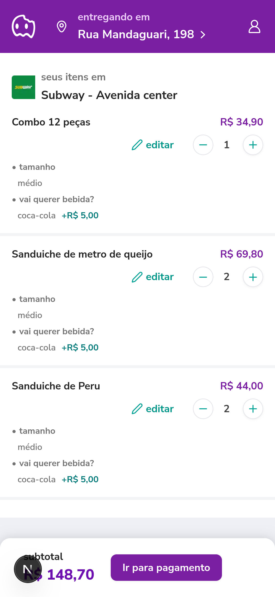

# AiqFome Teste Frontend

Aplicação web desenvolvida em Next.js com foco na experiência mobile e fluidez da interface. Criada como parte de um desafio técnico de front-end.

## Features

> Todas as features acompanham o planejamento realizado e gerenciado no Project do GitHub

- Listagem de lojas por categoria
- Exibição de produtos de cada loja
- Adição de produtos ao ticket
- Visualização do ticket atual
- Persistência local com `localStorage`
- Design responsivo e mobile-first
- Performance otimizada com Server Components
- Boas práticas com componentes funcionais, hooks e contextos

## Planejamento

O projeto foi todo organizado, arquitetado e refinado. Após essas etapas, criei um Projeto no GitHub chamado aiqfome Projects, com as colunas (Backlog/In Progress/Done) e coloquei todas as tarefas mínimas dos requisitos com seus respectivos critérios de aceite, conforme imagem abaixo:


## Acessando na web

Clique [aqui](https://ws-aiqfome-gs8yr2kao-werliton-silvas-projects.vercel.app/lojas/mat/japonesa-mat/sushi-1) para acessar a versão deployada

## Telas da aplicação

A seguir as telas da aplicação, ordenadas por suas respectivas funcionalidades

### Home: Listagem inicial das lojas


### Loja: Listagem de detalhe da loja e as categorias com respectivos produtos


### Detalhe do produto


### Ticket



## Integração e dinamicidade dos dados

A seguir os componentes que são dinâmicos:

- Lista de Lojas na home
-

## Tecnologias utilizadas

- [Next.js 14](https://nextjs.org/)
- [React 18](https://react.dev/)
- [Tailwind CSS](https://tailwindcss.com)
- [Shadcn/ui](https://ui.shadcn.com)
- [Atomic Design](https://atomicdesign.bradfrost.com/) + Clean Architecture
- [Zustand](https://zustand-demo.pmnd.rs/)

## Estrutura

```
├── docs/
├── public/
│   └── images/
│   └── icons/
├── src/
│   ├── app/                      # app route
│   ├── components/ui/            # Componentes atômicos e compostos
│   ├── hooks/                    # Custom Hooks
│   ├── lib/                      # Helpers
│   ├── mocks/                    # Mocks de dados
│   ├── types/                    # Modelos e tipo
```

## Layout

### Quebra de layout

Criei um mapeamento de componentes que precisei utilizar e reaproveitar do ShadcnUI.


Componentes instalados:

- [Input](https://ui.shadcn.com/docs/components/input)
- [Scroll-area](https://ui.shadcn.com/docs/components/scroll-area)
- [Card](https://ui.shadcn.com/docs/components/card)
- [Collapsible](https://ui.shadcn.com/docs/components/collapsible)


Componentes instalados:

- [Checkbox](https://ui.shadcn.com/docs/components/checkbox)
- [Radio Group](https://ui.shadcn.com/docs/components/radio-group)

## Como usar

### 1. Clone o projeto

```bash
git clone https://github.com/werliton/ws-aiqfome.git

cd ws-aiqfome
```

### 2. Instale as dependências

```bash
pnpm install
```

### 3. Inicie o app

```bash
pnpm run dev
```

A aplicação local está disponível na seguinte [url](http://localhost:3000)

## Testes (WIP)

Para executar testes, basta executar o comando abaixo:

```bash
pnpm run test
```

## Build de produção

```bash
pnpm run build && pnpm start
```

## Plugins VSCode utilizados

- VSCode Conventional Commits

## Autor

- Werliton Silva
  - [Linkedin](https://www.linkedin.com/in/werliton-silva/)
  - [Dev.to](https://dev.to/werliton)

## Licença

MIT

## Aprendizados

- Conversor de cores code: https://oklch.com
- Extensões do Figma: https://extensions.zeplin.io/
- Cuidado ao usar icones do Lucid. Eles podem limitar a alterar de tamanhao, devido ao viewbox.

## Futuras melhorias

- Integração do Lighthouse CI (já tenho um projeto rodando com ele)
- Criação de testes unitários
